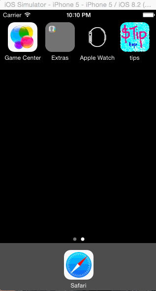

# Tips Calculator

This is an IOS demo application for calculating tips. Its developed as part of CodePath assignment. 

Time spent : 12 hours 

Completed user stories 

* [x] Calculate tips and total amount
* [x] Optional: Split the total amount
* [x] Navigate to setting page and back
* [x] Changes in setting page reflected in main view
* [x] Optional : Beware of app going in background and back. Reset application state after 2 minutes.
* [ ] Optional : Themes

Note : Played with UISliderView , changed its default images. TBD  Resize thumb image properly.

Walkthrough of all user stories : 

